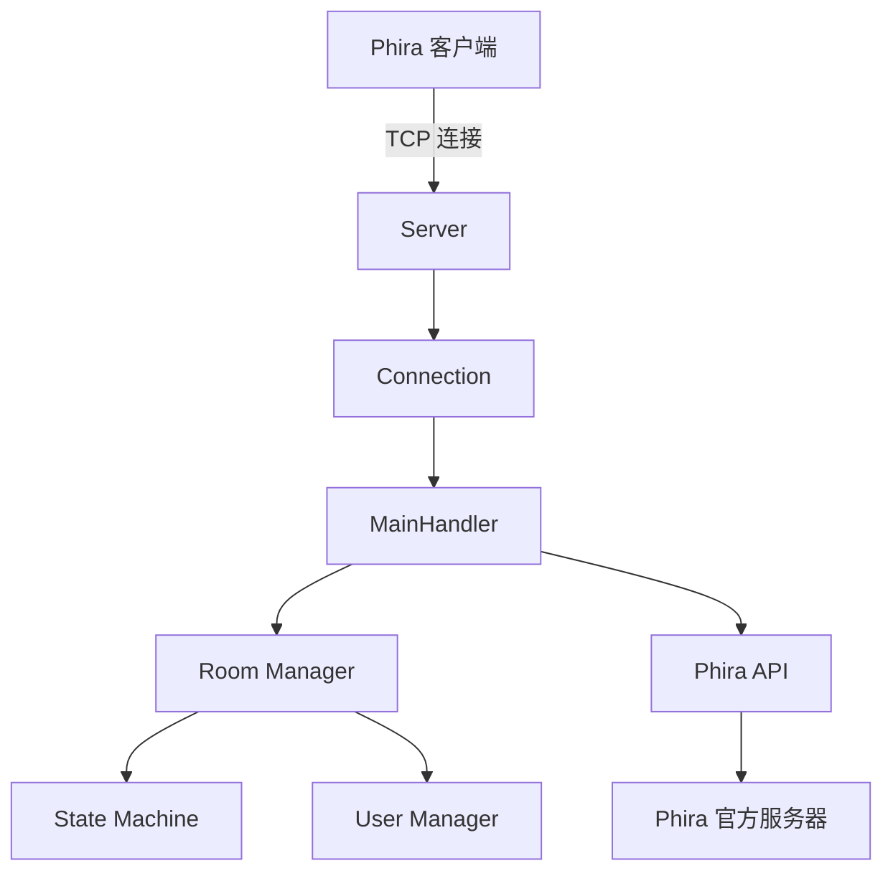
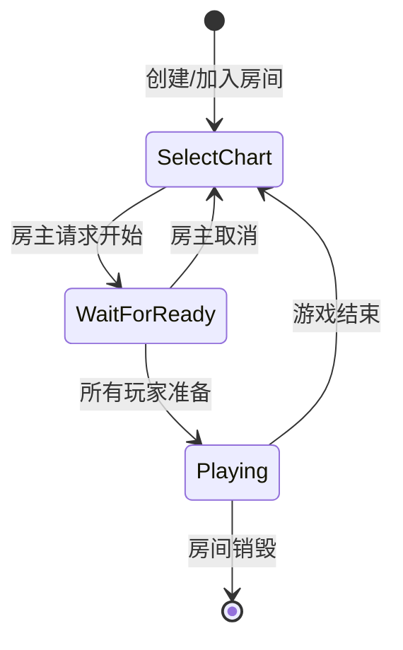

# pphira-mp

一个基于 Python 的 **Phira** 多人游戏服务器实现，支持多玩家在线协作游玩 Phira 谱面。

---

## 目录

- [功能特性](#功能特性)
- [技术架构](#技术架构)
- [核心组件](#核心组件)
- [快速开始](#快速开始)
- [配置说明](#配置说明)
- [协议实现](#协议实现)
- [游戏状态机](#游戏状态机)
- [项目结构](#项目结构)
- [开发文档](#开发文档)
- [贡献指南](#贡献指南)
- [许可证](#许可证)
- [致谢](#致谢)
- [联系方式](#联系方式)

---

## 功能特性

- **多房间支持**：支持创建和加入多个游戏房间
- **实时协作**：多玩家可同时在同一房间中游玩
- **状态管理**：完整的游戏状态机（选谱、准备、游戏中等状态）
- **权限系统**：支持房主和监控者权限管理
- **国际化**：支持多语言错误消息提示
- **异步架构**：基于 `asyncio` 的高性能异步 IO 处理
- **Phira 协议**：完整实现 Phira 客户端-服务器通信协议

---

## 技术架构



---

## 核心组件

- **Server**：TCP 服务器，处理客户端连接
- **Connection**：管理单个客户端连接的生命周期
- **MainHandler**：核心业务逻辑处理器
- **Room Manager**：房间状态和用户管理
- **State Machine**：游戏状态转换管理
- **Phira API**：与 Phira 官方服务器交互

---

## 快速开始

### 环境要求

- Python 3.7+
- 网络连接（用于 Phira API）

### 安装步骤

1. **克隆项目**：

    ```bash
    git clone <repository-url>
    cd pphira-mp
    ```

2. **安装依赖**：

    ```bash
    pip install -r requirements.txt
    ```

3. **配置监控者（可选）**：

    编辑 `monitors.txt` 文件，添加监控者用户 ID（每行一个）

4. **启动服务器**：

    ```bash
    python main.py
    ```

服务器将在 `0.0.0.0:12346` 启动

---

## 配置说明

### 服务器配置

在 `main.py` 中可以修改以下配置：

```python
HOST = '0.0.0.0'  # 监听地址
PORT = 12346      # 监听端口
```

### 监控者配置

创建 `monitors.txt` 文件，每行添加一个监控者用户 ID：

```
12345
67890
```

### 国际化配置

错误消息配置在 `i10n/zh-rCN.json` 中：

```json
{
    "room_already_exist": "房间已经存在",
    "room_not_exist": "房间不存在",
    "user_already_exist": "用户已在房间中",
    "not_in_room": "您不在任何房间中",
    "not_host": "您不是房主，无法执行此操作"
}
```

---

## 协议实现

### 支持的数据包类型

> **客户端到服务器 (ServerBound)**

- `Authenticate`：用户鉴权
- `CreateRoom`：创建房间
- `JoinRoom`：加入房间
- `LeaveRoom`：离开房间
- `SelectChart`：选择谱面
- `RequestStart`：请求开始游戏
- `CancelReady`：取消准备

> **服务器到客户端 (ClientBound)**

- `Authenticate`：鉴权响应
- `CreateRoom`：创建房间响应
- `JoinRoom`：加入房间响应
- `LeaveRoom`：离开房间响应
- `SelectChart`：选谱响应
- `RequestStart`：开始游戏响应
- `CancelReady`：取消准备响应
- `Message`：聊天消息
- `ChangeState`：状态变更通知

---

## 游戏状态机



---

## 项目结构

```
pphira-mp/
├── main.py                 # 主程序入口
├── server.py              # 服务器核心逻辑
├── connection.py          # 连接管理
├── room.py                # 房间管理
├── phiraapi.py            # Phira API 接口
├── i10n.py                # 国际化支持
├── asyncioutil.py         # 异步工具函数
├── monitors.txt           # 监控者列表
├── i10n/
│   └── zh-rCN.json        # 中文翻译
├── rymc/                  # Phira 协议实现
│   └── phira/
│       ├── protocol/      # 协议层
│       │   ├── packet/    # 数据包定义
│       │   ├── data/      # 数据结构
│       │   ├── handler/   # 处理器
│       │   ├── codec/     # 编解码器
│       │   ├── exception/ # 异常定义
│       │   └── util/      # 工具类
│       └── __init__.py
├── README.md              # 项目说明
└── DEVELOPMENT.md         # 开发规范
```

---

## 开发文档

详细的开发规范请查看 [DEVELOPMENT.md](./DEVELOPMENT.md)

### 快速开发指南

**添加新功能**：

1. 分析需求并设计协议
2. 在 `rymc/phira/protocol/` 下创建新数据包
3. 在 `MainHandler` 中添加处理方法
4. 更新房间逻辑和国际化文本

**添加新数据包**：

```python
# 在 rymc/phira/protocol/packet/serverbound/ 创建
class ServerBoundNewPacket(ServerBoundPacket):
    def __init__(self, param1, param2):
        self.param1 = param1
        self.param2 = param2
```

**错误处理规范**：

```python
# 返回状态码字典
return {"status": "0"}  # 成功
return {"status": "1"}  # 失败类型1
return {"status": "2"}  # 失败类型2
```

---

## 贡献指南

欢迎提交 Issue 和 Pull Request！

1. Fork 本仓库
2. 创建特性分支 (`git checkout -b feature/AmazingFeature`)
3. 提交更改 (`git commit -m 'Add some AmazingFeature'`)
4. 推送到分支 (`git push origin feature/AmazingFeature`)
5. 开启 Pull Request

---

## 许可证

本项目采用 **MIT** 许可证 - 查看 [LICENSE](./LICENSE) 文件了解详情

---

## 致谢

- **Phira**：优秀的开源节奏游戏
- **lRENyaaa**：Phira 协议实现
- **Evi233**：服务器逻辑实现

---

## 联系方式

- **项目地址**：[GitHub Repository](<repository-url>)
- **问题反馈**：[Issues](<repository-url>/issues)

> **注意**：这是一个早期的测试版本，功能仍在完善中。欢迎提供反馈和建议！